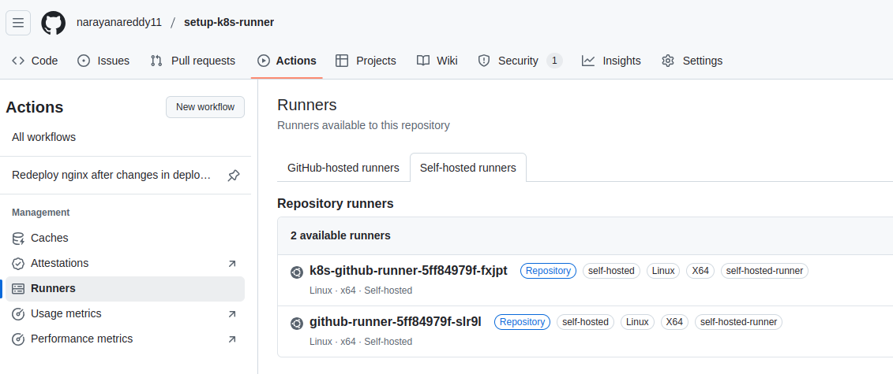

### Set up a Kubernetes pod as Self-hosted runner for GitHub Actions. 
---

### 1. Clone the Repository to VS Code
Clone the repository using the following command:
  ```bash 
    git clone https://github.com/narayanareddy11/setup-k8s-runner.git
   ```

### 2. Update the GitHub Personal Access Token
1. Go to your GitHub account settings.
2. Navigate to **Developer settings** > **Personal access tokens** > **Tokens (classic)**.
3. Generate a new token with the required permissions:
    - Set the expiration to **30 days**.
    - Select the scope to include **all repositories**.
4. Replace the old token in your configuration files or environment variables.


### 3. Update Base64 Encoded Values in `secret.yaml`
1. Use the following command to encode your token or other sensitive data:
    ```bash
    echo -n "ghp_your_generated_token" | base64
    ```
2. Open the `secret.yaml` file in your preferred text editor.

3. ocate the `data` section and Replace the old base64 value with the new one generated in step 1:
    ```yaml
    data: 
      TOKEN: "your-new-base64-encoded-value"

    ```

### 4. Update GitHub Username and Repository Name Secret in `ge-deployment.yaml`
1. Open the `ge-deployment.yaml` file in your preferred text editor.
2. Locate the section where the GitHub username and repository name secrets are defined.
3. Update the secret for the GitHub username:
    ```yaml
    - name: GITHUB_USERNAME
      value: "your-new-username"
    ```
4. Update the secret for the repository name:
    ```yaml
    - name: REPOSITORY_NAME
      value: "your-new-repository-name"
    ```

### 5. Deploy the Self-Hosted Runner Using `kubectl`
1. Ensure you have `kubectl` installed and configured to interact with your Kubernetes cluster.
2. Navigate to the directory containing your Kubernetes manifests:
    ```bash
    cd /home/narayana/Desktop/setup-k8s-runner-1
    ```
3. Apply the manifests to deploy the runner:
    ```bash
    kubectl apply -f selfthosted-runner
    ```
4. Verify that the pods are running:
    ```bash
    kubectl get pods
    ```
5. Check the logs of the runner pod to ensure it is registered successfully:
    ```bash
    kubectl logs <runner-pod-name>
    ```
6. Confirm that the runner is active in your GitHub repository under **Settings** > **Actions** > **Runners**.

### 6. Verify the Runner Registration in Kubernetes
1. After applying the changes, navigate to your GitHub repository.
2. Go to **Settings** > **Actions** > **Runners**.
3. Verify that the Kubernetes runner is listed as an active runner.


---  